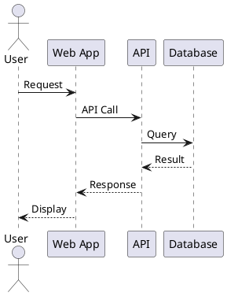

# HLD/LLD Template

## High-Level Design (HLD)

### 1. System Overview
- **Purpose:** [What problem does this system solve?]
- **Scope:** [What's included/excluded]
- **Key Stakeholders:** [Who uses/maintains this system]

### 2. System Context (C4 Level 1)
[Embed C4 System Context diagram]
- System in scope
- External systems/users
- Key interactions

### 3. Major Components
| Component | Responsibility | Technology |
|-----------|----------------|------------|
| Component 1 | [What it does] | [Tech stack] |
| Component 2 | [What it does] | [Tech stack] |

### 4. External Dependencies
- **[Dependency 1]:** Purpose, protocol, data exchanged
- **[Dependency 2]:** Purpose, protocol, data exchanged

### 5. Data Flow
[Diagram showing how data moves through the system]
- Critical data paths
- Data transformations
- Data storage points

### 6. Technology Stack
| Layer | Technology | Justification (link to ADR) |
|-------|------------|----------------------------|
| Frontend | React | ADR-001 |
| Backend | Node.js | ADR-002 |
| Database | PostgreSQL | ADR-003 |

### 7. Deployment Architecture
[High-level deployment diagram]
- Environments (dev, staging, prod)
- Infrastructure components
- Network topology

---

## Low-Level Design (LLD)

### 1. Container Diagram (C4 Level 2)
[Embed C4 Container diagram showing deployable units]
- Web application
- API server
- Database
- Message queues
- Protocols between containers

### 2. Component Diagram (C4 Level 3)
[Embed C4 Component diagram for each major container]
- Internal modules
- Component responsibilities
- Dependencies (acyclic)

### 3. Sequence Diagrams
**Critical Workflow 1:** [Name]


**Critical Workflow 2:** [Name]
[Sequence diagram]

**Critical Workflow 3:** [Name]
[Sequence diagram]

### 4. State Diagrams (for complex entities)
[State machine diagrams for entities with complex lifecycle]

### 5. Module Dependency Graph
```
┌─────────────┐
│ Controller  │
└──────┬──────┘
       │
       ▼
┌─────────────┐
│  Service    │
└──────┬──────┘
       │
       ▼
┌─────────────┐
│ Repository  │
└─────────────┘
```

**Dependency Rules:**
- Controllers → Services (allowed)
- Services → Repositories (allowed)
- Repositories ↛ Services (forbidden)
- No circular dependencies

### 6. Class Diagrams (Optional, C4 Level 4)
[Class diagrams for critical components]
- Public interfaces
- Key methods
- Relationships (composition, aggregation, inheritance)

### 7. Error Handling Strategy
- Exception hierarchy
- Error codes/messages
- Logging levels
- Retry policies

### 8. Concurrency & Threading
- Async operations
- Thread pools
- Synchronization points
- Race condition mitigations
