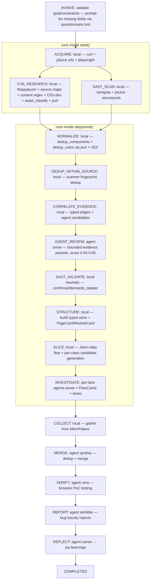

# jsa — JavaScript Security Analysis

Production-grade multi-agent JavaScript security analysis. Downloads, structures, slices, dispatches per-lane agents, and reports vulnerabilities across 22 classes with expert-level depth. Uses a typed analysis store (PageCard/ModuleCard/FlowCard) for bounded context and lane-based packetization for efficient agent dispatch.

## When to Use

- Bug bounty JavaScript analysis — find vulnerabilities in target web applications
- Source code security review — analyze local JS/TS codebases
- Post-discovery analysis — feed target URLs for deep JS vulnerability discovery
- You need production-safe, independently verified findings with CVSS 4.0 scoring

## When NOT to Use

- Simple grep or linting (this is deep multi-step analysis)
- Non-JavaScript targets (binary, server-side Java/Python, etc.)

## Invocation

Invoke via the `skill` tool. The skill extension handles orchestration — agents communicate via mempalace, Penny receives structured summaries.

The `skill` extension handles the entire orchestration loop. Penny's context stays clean — agents communicate via mempalace, and Penny only sees structured summaries.

```
skill({{
  skill_name: "jsa",
  goal: "Your target URL or scope",
  project_root: "/path/to/project"
}})
```


---

## Usage

The jsa skill accepts all target configuration inline via `goal` and `constraints`. Required fields:

- `target_url` — the URL to analyze (also auto-extracted from the `goal` text)
- `authenticated_testing` — `anonymous_only` / `both` / `authenticated_only`
- `session_management` — `cookie` / `jwt_header` / `oauth2` / `custom_header` / `mixed`
- `auth_instructions` — required when `authenticated_testing` is not `anonymous_only`

### Happy path (all required fields inline)

```
skill({
  skill_name: "jsa",
  goal: "Analyze JavaScript on https://ginandjuice.shop",
  constraints: {
    // Pipeline-level config (top-level of constraints, NOT inside intake):
    output_dir: "/tmp/gin-and-juice-test",
    out_of_scope: ["https://ginandjuice.shop/vulnerabilities"],

    // Intake answers (passed when INTAKE escalation should be skipped):
    intake: {
      target_url: "https://ginandjuice.shop",
      authenticated_testing: "both",
      auth_instructions: "login at /login as carlos/hunter2",
      session_management: "cookie",
    },
  },
})
```

INTAKE validates the configuration, all required fields are present, and the pipeline auto-advances through ACQUIRE → CVE_RESEARCH → ... → REFLECT → COMPLETED in the same call.

### Missing fields path (escalation)

If required fields are missing, INTAKE returns an `escalate_to_user` action carrying a `questions` array (the canonical UNKNOWN_STATE escalation protocol). The skill tool routes this to Penny, who:

1. Invokes the `questionnaire` tool with the questions from the escalation
2. Collects the user's answers (including free-text via the "Type something" option)
3. Re-invokes the skill with `constraints.intake` populated:

```
skill({
  skill_name: "jsa",
  goal: "Analyze JavaScript on https://ginandjuice.shop",
  constraints: {
    intake: {
      target_url: "https://ginandjuice.shop",
      authenticated_testing: "both",
      auth_instructions: "login at /login as carlos/hunter2",
      session_management: "cookie",
    },
  },
})
```

### With Specific Analyzers

```
skill({
  skill_name: "jsa",
  goal: "Analyze JS on https://example.com",
  analyzers: ["dom_xss", "prototype_pollution", "postmessage"]
})
```

### With Source Code

```
skill({
  skill_name: "jsa",
  goal: "Analyze JavaScript in ./src/app/"
})
```

### All Parameters

| Parameter | Required | Description |
|-----------|----------|-------------|
| `skill_name` | Yes | Must be `"jsa"` |
| `goal` | Yes | Target URL, source code path, or both |
| `analyzers` | No | List of vuln classes to analyze (default: all 22) |
| `constraints.output_dir` | No | **Top-level** key inside `constraints`. Report output directory. Defaults to `/tmp/jsa-{hostname}`. If the resolved path would land inside the project tree (contains `AGENTS.md`/`.pi`/`.git`), it is auto-redirected to `/tmp/jsa-{hostname}` for safety. |
| `constraints.intake` | No | Pre-collected intake answers. If supplied, INTAKE skips escalation and runs the pipeline. Valid keys: `target_url`, `out_of_scope`, `authenticated_testing`, `auth_instructions`, `session_management`, `roles`, `session_details`. |
| `constraints.out_of_scope` | No | **Top-level** key. List of URL substrings (or a newline-separated string) that must NEVER be fetched, crawled, or PoC'd. Enforced in ACQUIRE (crawler), INVESTIGATE (worker prompts), and VERIFY (browser PoC). Substring match. |

> **Common mistake:** putting `output_dir` or `out_of_scope` *inside* `constraints.intake`. These are **top-level** constraint keys, not intake fields. The intake schema is for questionnaire responses; output path and scope are pipeline-level configuration.

---

## Pipeline



```
INTAKE → ACQUIRE → CVE_RESEARCH → SAST_SCAN → NORMALIZE → DEDUP_WITHIN_SOURCE 
→ CORRELATE_EVIDENCE → AGENT_REVIEW → SAST_VALIDATE → STRUCTURE → SLICE 
→ INVESTIGATE → COLLECT → MERGE → VERIFY → REPORT → REFLECT → COMPLETED
```

> **Note:** ACQUIRE, CVE_RESEARCH, SAST_SCAN run locally inside `start()` before returning the first agent action. NORMALIZE, DEDUP_WITHIN_SOURCE, CORRELATE_EVIDENCE, AGENT_REVIEW, SAST_VALIDATE, STRUCTURE, SLICE, INVESTIGATE, COLLECT run locally inside `step(annie)` before returning MERGE.
>
> A temporary interactive checkpoint may be inserted between SAST_VALIDATE and STRUCTURE for user inspection in interactive mode. This is **not a permanent pipeline phase** — it is not represented in the FSM enum or flow diagrams.

| Phase | Run By | What Happens |
|-------|--------|-------------|
| **INTAKE** | — (Penny) | Validate target configuration. Required: `target_url`, `authenticated_testing`, `session_management`; conditionally `auth_instructions` when authenticated testing ≠ anonymous. If anything is missing, INTAKE returns an **`escalate_to_user`** action carrying a `questions` array — the canonical UNKNOWN_STATE escalation protocol. The skill tool routes this to Penny, who invokes the `questionnaire` tool, collects the user's answers, and feeds them back via `step --agent user`. Once all required fields are present, INTAKE auto-advances to ACQUIRE in the same `start()` call. |
| **ACQUIRE** | local | curl homepage → regex script srcs → curl JS files → jsluice urls recursive discovery (depth=3) + runtime probes |
| **CVE_RESEARCH** | local | Wappalyzer fingerprint engine (3,911 technologies) + source-map parsing + content regex fallback + asset classification + purl canonical IDs + initial VEX status |
| **SAST_SCAN** | local | semgrep (jsa preset, 369 rules) + jsluice secrets + jsluice urls on ALL files; produces SARIF-style fingerprints |
| **NORMALIZE** | local | `dedup_components` (purl canonical) + `dedup_vulnerabilities` (CVE alias canonicalization) + VEX status per CVE |
| **DEDUP_WITHIN_SOURCE** | local | `scanner_dedup.merge_scanner_findings()` — dedup SAST findings by SARIF fingerprints and similarity |
| **CORRELATE_EVIDENCE** | local | Cross-stream correlation via typed edges (component→vuln, SAST→vuln). Hard gates + positive/negative signals. `select_agent_candidates()` filters to score 0.45-0.85 |
| **AGENT_REVIEW** | annie | Reviews ambiguous correlation edges via **bounded evidence packets** (no raw code). Produces verdict + confidence_override + recommended_action |
| **SAST_VALIDATE** | local heuristic | Triage SAST findings: confirmed / false_positive / needs_deeper (with first-party vs third-party awareness from correlation) |
| **STRUCTURE** | local | **Phase B+** — Build typed analysis store. Parse HTML for page context, query Caido (graceful if unavailable), build PageCard/ModuleCard. Replaces old CHUNK phase. |
| **SLICE** | local | **Phase B+** — Per-class candidate generation + vulnerability-specific slice extraction (Joern CPG with graceful degradation). Build FlowCard. Replaces CHUNK+DISPATCH anti-pattern. |
| **INVESTIGATE** | annie × N | **Phase B+** — Per-lane agent dispatch consuming FlowCards. Renamed from DISPATCH. Lanes: code_static (FlowCard), page_dom (PageCard + FlowCards), network_behavior (PageCard with Caido HTTP history). |
| **COLLECT** | local | Gather findings from MemPalace `{session_id}-findings` room |
| **MERGE** | synthia | Algorithmic dedup + cross-card stitching + confidence promotion |
| **VERIFY** | vera | Browser PoC testing: navigate, inject payloads, capture screenshots |
| **REPORT** | skribble | Structured findings: title, STR, code analysis, CVSS 4.0, remediation |
| **REFLECT** | carren | FP/FN pattern identification → jsa-learnings for self-improvement |

### Two-Pass Architecture (with Correlation Layer)

**Pass 1 — Deterministic Automation (seconds):**
- `ACQUIRE` downloads JS files
- `CVE_RESEARCH` detects components via Wappalyzer + source maps + content regex
- `SAST_SCAN` runs semgrep + jsluice on all files

**Correlation Layer (deterministic + bounded agent):**
- `NORMALIZE` — `dedup_components` (purl canonical) + `dedup_vulnerabilities` (CVE alias canonicalization) + VEX status per CVE
- `DEDUP_WITHIN_SOURCE` — `scanner_dedup.merge_scanner_findings()` dedups SAST by SARIF fingerprints
- `CORRELATE_EVIDENCE` — cross-stream typed edges (component→vuln, SAST→vuln) with hard gates + positive/negative signals
- `AGENT_REVIEW` (annie) — reviews only ambiguous correlation edges (score 0.45-0.85) via bounded evidence packets
- `SAST_VALIDATE` (local heuristic) — triage findings as confirmed/false_positive/needs_deeper, informed by correlation evidence

**Pass 2 — Deep Analysis (minutes):** Vulnerable code is identified via tree-sitter + Joern (when available), per-class candidates are sliced, and per-lane agents investigate. Agents:
- Skip confirmed SAST findings (already found)
- Ignore false positives (validated noise)
- Verify NEEDS_DEEPER items
- Find multi-step chains, framework bypasses, and patterns SAST misses

This mirrors how a human tester works: run automated scanners first, correlate deterministic signals, ask agents only for bounded judgment on ambiguous cases, then focus deep analysis where it matters.

### Three-Lane Architecture (STRUCTURE → SLICE → JUDGE)

The deep analysis pass (formerly "Pass 2") has been refactored to a structure-and-slice architecture per `agent-augmented-security-annalysis.md`. The new flow has 3 phases that replace the old CHUNK → DISPATCH sequence:

- **STRUCTURE** (local) — Build a typed analysis store and emit `PageCard` / `ModuleCard` records. Parses HTML, builds file manifest, AST index, runs tree-sitter queries for dangerous patterns.
- **SLICE** (local) — Per-class candidate generation. Uses vuln-class heuristics, dangerous patterns, and (when available) Joern data flow queries. Emits `FlowCard` records with proper CWE + lane assignment.
- **INVESTIGATE** (per-lane agent dispatch) — Three lanes with different packet types:

| Lane | Analyzers | Packet Type |
|------|-----------|-------------|
| `code_static` | `dom_xss`, `prototype_pollution`, `csti`, `postmessage`, `open_redirect`, `secret_disclosure`, `request_override`, `link_manipulation`, `dom_data_manipulation`, `ssrf`, `sqli`, `insecure_deserialization`, `http_header_injection` | `FlowCard` (with source/sink/sanitizer info, ~50-200 lines of code) |
| `page_dom` | `dom_clobbering`, `reflected_xss`, `stored_xss`, `csrf_dom` | `PageCard` + relevant `FlowCards` (HTML structure + JS correlation) |
| `network_behavior` | `cors`, `clickjacking`, `idor`, `cache_poisoning`, `http_smuggling`, `csrf_network` | `PageCard` with Caido HTTP history (request/response, headers) |

Each agent prompt (`assets/prompts/annie-{vuln_class}.md`) declares its lane so JUDGE can route work items correctly. The `scripts/lane_router.py` module is the source of truth for the lane-to-analyzer mapping.

---

## Vulnerability Classes (22 Analyzers)

### File-Level (JS Code Analysis)

| Analyzer | Key Patterns |
|----------|-------------|
| `dom_xss` | Sources (location.*, document.referrer, postMessage, storage) → sinks (innerHTML, eval, document.write, jQuery html()) |
| `reflected_xss` | URL parameter reflection in HTTP responses, server-rendered injection |
| `stored_xss` | Persistent injection via forms, persisted in DB/API and rendered unsanitized |
| `prototype_pollution` | `__proto__`, `constructor.prototype` manipulation via merge/extend operations |
| `csti` | Client-side template injection (AngularJS `{{}}`, Vue `v-html`, template literals with user input) |
| `postmessage` | Missing origin validation, wildcard targetOrigin, dangerous event.data handling |
| `dom_clobbering` | HTML elements colliding with JS variables, form/embed/iframe name collisions |
| `open_redirect` | `location.href =`, `window.open()`, `location.replace()` with user-controlled URLs |
| `ssrf` | Server-side URL fetching with user-controlled parameters |
| `sqli` | SQL query construction in client-side JS (Node.js backends, WebSQL) |
| `secret_disclosure` | API keys, tokens, credentials, internal URLs in JS source |
| `request_override` | XMLHttpRequest/fetch URL override, request hijacking |
| `link_manipulation` | `<a href>`, `<link href>`, `<script src>` manipulation |
| `http_header_injection` | Header injection via XHR/fetch, response splitting |
| `dom_data_manipulation` | DOM manipulation that alters security-sensitive elements |

### Page-Level (Browser Behavior Analysis)

| Analyzer | Key Patterns |
|----------|-------------|
| `csrf` | Missing CSRF tokens in forms, token validation bypasses |
| `cors` | Misconfigured Access-Control headers, credentials exposure |
| `clickjacking` | Missing X-Frame-Options, framebusting bypass |
| `idor` | Object reference manipulation in API calls |
| `http_smuggling` | Request smuggling via content-length/transfer-encoding confusion |
| `cache_poisoning` | Cache key injection, unkeyed header reflection |

---

## Prompt Architecture

### Prompts vs References

| Layer | Location | Size | Content |
|-------|----------|------|---------|
| **Worker prompts** | `assets/prompts/annie-{vuln_class}.md` | 3-5 KB each | Actionable analysis workflow, top sources/sinks, detection commands, false positive checks, scanner configuration |
| **Agent protocols** | `assets/prompts/{agent_name}-base.md` | 2-3 KB each | Per-agent protocol: echo acquisition, vera verification, skribble reports, synthia merge, carren reflection |
| **Reference catalogs** | `assets/references/{vuln_class}/` | Full detail | Complete source/sink catalogs, all payload variants, sanitizer bypasses by version, framework-specific patterns, exploitation chains |
| **Foundational research** | `research/jsa/analyze-*.md` | 18-51 KB each | Comprehensive research documents with CVEs, historical context, academic references |

**Naming convention:** `<agent_name>-<role>.md` — `annie-dom_xss.md` for the DOM XSS analysis worker, `annie-cve.md` for the CVE researcher, `vera-base.md` for verification protocol.

### CVE Research — Offline Fingerprint Detection

The CVE_RESEARCH phase runs locally (no agent) using the **Wappalyzer fingerprint database** (3,911 technologies, vendored from wapalyzer-core v6.11.0, MIT licensed).

1. **Fingerprint engine** (`fingerprint_engine.py`) matches filenames against 2,146 `scriptSrc` patterns and file content against 462 `scripts` + `html` patterns
2. **Version extraction** via Wappalyzer's `\;version:\1` annotation syntax on filename patterns
3. **Content fallback**: 9 content-based version regex patterns supplement Wappalyzer for in-file version comments (e.g., `/*! jQuery v3.7.1 */`)
4. Results stored in `state.metadata["cve_research"]` with per-technology versions, confidence scores, and detection vectors
5. A temporary interactive checkpoint may be inserted after SAST_VALIDATE for user inspection of the consolidated evidence before per-class slicing. This is not a permanent pipeline phase.
6. **CVE lookup** is deferred to vuln-class agents during INVESTIGATE deep analysis

This replaces the previous 88-pattern regex LIBRARIES list. The `annie-cve.md` prompt is retained for future INVESTIGATE-phase CVE research integration.

### Structure + Slice Architecture

The deep analysis pass uses a typed analysis store and per-class candidate generation. The flow is:

**STRUCTURE** (local) builds the typed analysis store:
- Parses JS files with tree-sitter for AST indexes
- Parses HTML files for DOM inventory (PageCard)
- Extracts dangerous patterns via tree-sitter queries (`innerHTML`, `eval`, `Object.assign`, `fetch`, `location.*`, `setTimeout` with strings, `postMessage` listeners)
- Builds ModuleCard (per JS/HTML file) and PageCard (per crawled page)
- Queries Caido for HTTP history (graceful degradation if not running)

**SLICE** (local) generates per-class candidates:
- Uses vuln-class heuristics and tree-sitter pattern matching
- When available, uses Joern CPG queries for data flow analysis
- Caps at 20 candidates per vuln class to prevent card explosion
- Emits FlowCard records with proper CWE + sink mapping + lane assignment

**INVESTIGATE** (per-lane agent dispatch) consumes the cards:
- code_static lane: receives FlowCard (source/sink/sanitizer info, ~50-200 lines of code)
- page_dom lane: receives PageCard + relevant FlowCards (HTML structure + JS correlation)
- network_behavior lane: receives PageCard with Caido HTTP history (request/response, headers)

### Per-Lane Agent Dispatch

Each agent operates on a single card in one of three lanes. A 500-file enterprise app with 3 analyzers produces hundreds of agents running in waves — completing in minutes. Each agent has bounded context (FlowCard/PageCard is 2-15K tokens, never the full codebase).

### MemPalace-Native Communication

Agents communicate via dedicated `wing_jsa` rooms:
- `{session_id}-mesh` — who's working on what
- `{session_id}-feed` — findings, cross-card hints, status updates
- `{session_id}-findings` — raw per-agent findings
- `{session_id}-merged` — deduplicated merged findings
- `jsa-learnings` — cross-session pattern corrections (persistent)

### Pre-Filtering (Dangerous Pattern Detection)

Before per-class analysis, files are scanned for dangerous patterns. Files without any analyzer's sinks are excluded from deep analysis. This typically eliminates 60-80% of vendor/library files before per-class candidate generation.

---

## Output

Every finding includes:
1. **Title** — descriptive, specific, includes vuln class and location
2. **Description** — thorough technical explanation in application context
3. **Steps to Reproduce** — copy/paste executable curl/playwright commands
4. **Code Analysis** — source-to-sink walkthrough with line references
5. **Remediation** — tech-stack-specific, actionable. No generic guidance.
6. **CVSS 4.0** — full vector with exploitability and impact justification

Output location: `{output_dir}/reports/jsa-{session_id}/report.md`
Evidence: `{output_dir}/evidence/jsa-{session_id}/`

---

## Production Safety

- All browser testing uses `alert()`, `console.log()`, `confirm()` only
- No data exfiltration payloads
- No destructive DOM mutations
- No persistent modifications without explicit user approval
- Scope boundary enforcement prevents out-of-scope testing

---

## Prerequisites

- **semgrep** CLI — pattern-based SAST scanning
- **jsluice** CLI — URL and secret extraction from JavaScript
- **Playwright** — browser automation (via our playwright extension)
- **tree-sitter** + tree-sitter-javascript — AST parsing
- **MemPalace** — inter-agent communication (already configured)
- **Node.js / npx** — js-beautify, synchrony, webcrack (deobfuscation)

---

## Storing Learnings

After the skill completes, store session results in mempalace:

```python
memory_add_drawer(wing="penny", room="skills", content="## jsa Skill Session\n\n**Goal:** {goal}\n**Success:** {is_success}")
memory_kg_add(f"SkillSession:{session_id}", "completed", f"Skill:jsa:{goal[:50]}")
```
