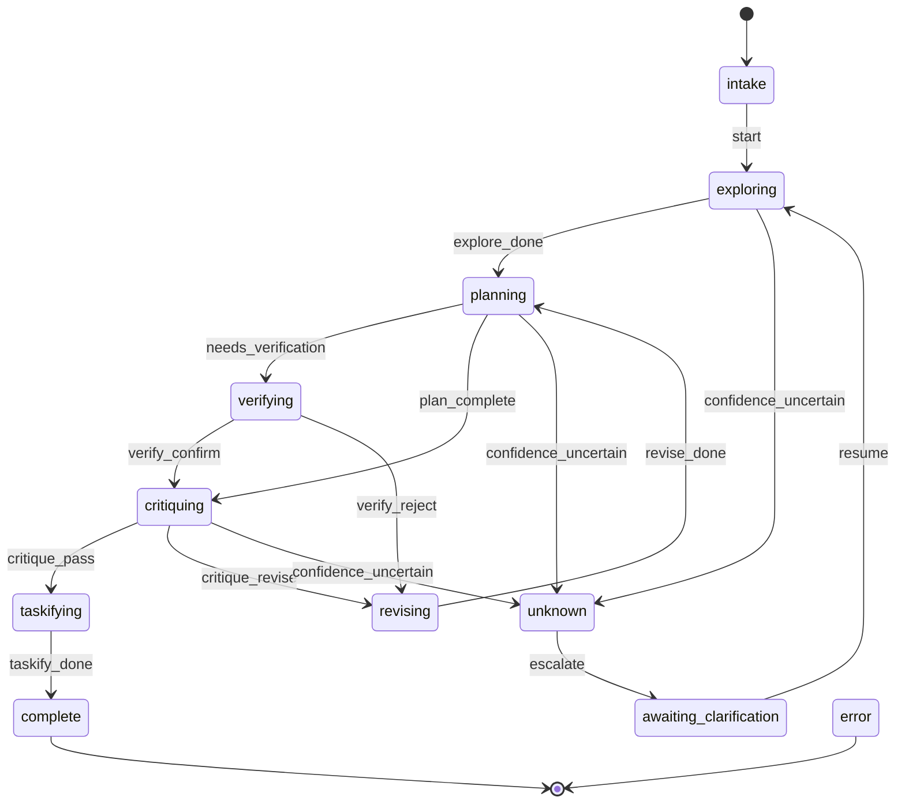

# Skill Flow Diagrams — Visual reference for skill state machines

## What

Mermaid flow diagrams showing state transitions for each skill's orchestrator. Used for design review and debugging.

## Why

State machines with 10+ states and conditional transitions are hard to reason about from code alone. Diagrams make the flow explicit.

## Rules

1. **One diagram per skill.** Stored in `resources/flow.mmd` within the skill directory.
2. **Mermaid format.** Compatible with GitHub, VS Code, and most markdown renderers.
3. **Show all states and transitions.** Include conditional guards as edge labels.

## Example: Plan Skill

## Constraints

- **Diagrams must match implementation.** Stale diagrams are worse than no diagrams.
- **Update diagram when state machine changes.** Part of the same PR.

## Verification

- [ ] Diagram shows all states from `orchestrate.py`
- [ ] All transitions match implementation
- [ ] Conditional guards labeled on edges

## Files

| File | Purpose |
|------|---------|
| `.pi/skills/plan/resources/flow.mmd` | Plan skill diagram |
| `docs/agents/skills/orchestration.md` | Orchestrator protocol |
