# Skill Flow Diagrams — Visual reference for skill state machines

## What

Mermaid flow diagrams showing the state transitions of each skill's engine playbook (the `BasePlaybook` subclass in `apps/orchestration/src/orchestration/playbooks/<skill>.py`). Used for design review and debugging.

## Why

State machines with 10+ states and conditional transitions are hard to reason about from code alone. Diagrams make the flow explicit.

## Rules

1. **One diagram per skill.** Stored in `resources/flow.mmd` within the skill directory; it mirrors the playbook's `machine_cls` transitions.
2. **Mermaid format.** Compatible with GitHub, VS Code, and most markdown renderers.
3. **Show all states and transitions.** Include conditional guards as edge labels, and the `unknown → awaiting_clarification` escalation seam plus the terminal `complete`/`error` states.

## Example: Plan Skill

This mirrors `PlanMachine` in `apps/orchestration/src/orchestration/playbooks/plan.py` (and `.pi/skills/plan/resources/flow.mmd`):

```mermaid
stateDiagram-v2
    [*] --> intake
    intake --> exploring : start_explore
    exploring --> planning : explore_done
    planning --> verify_gate : plan_to_verify [needs_verification]
    planning --> critiquing : plan_to_critique [not needs_verification]
    verify_gate --> critiquing : verify_confirm [user confirms]
    verify_gate --> planning : verify_revise [user revises]
    critiquing --> taskifying : critique_pass [verdict APPROVE]
    critiquing --> exploring : critique_retry_explore [NEEDS_REVISION, explore_rounds<2]
    critiquing --> planning : critique_retry_plan [NEEDS_REVISION, explore_rounds>=2]
    critiquing --> taskifying : critique_exhausted [iteration cap; met=False]
    critiquing --> complete : critique_blocked [verdict BLOCKED; halt, met=False]
    taskifying --> complete : taskify_done
    exploring --> unknown : to_unknown
    planning --> unknown : to_unknown
    critiquing --> unknown : to_unknown
    taskifying --> unknown : to_unknown
    unknown --> awaiting_clarification : escalate
    awaiting_clarification --> exploring : clarify
    complete --> [*]
    error --> [*]
```

(`abort → error` edges from every non-terminal state are omitted here for readability; the skill's own `flow.mmd` shows them.)

## Constraints

- **Diagrams must match implementation.** Stale diagrams are worse than no diagrams.
- **Update the diagram when the playbook's machine changes.** Part of the same PR.

## Verification

- [ ] Diagram shows all states from the engine playbook's `machine_cls`
- [ ] All transitions match implementation
- [ ] Conditional guards labeled on edges

## Files

| File | Purpose |
|------|---------|
| `.pi/skills/plan/resources/flow.mmd` | Plan skill diagram |
| `apps/orchestration/src/orchestration/playbooks/plan.py` | Plan skill playbook (`PlanMachine`) |
| `docs/agents/skills/orchestration.md` | Engine-backed skill protocol |
